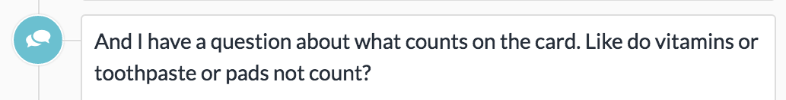
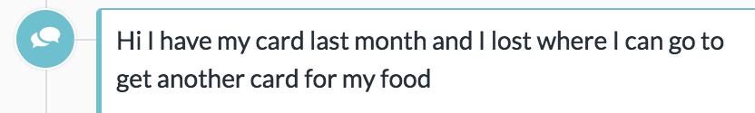
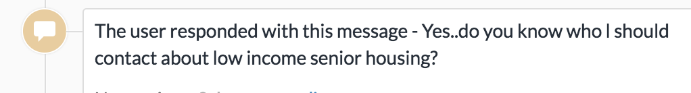

# Maximize
Help people with CalFresh maximize their benefits

## Background on CalFresh

The Supplemental Nutrition Assistance Program (SNAP), also known as food stamps, is the largest anti-hunger program in the country. In California, this program is known as CalFresh. The program provides approximately $250 a month for families to buy food.

Every year it raises 8.4 million people above the federal poverty line, including 3.8 million children.


## Overview of mRelief

mRelief is a tech nonprofit that provides an easy-to-use platform on web and text messaging for people to find out if they qualify and enroll in food stamps. Our mission is to restore dignity by transforming access to social services.

Our all woman software development team is focused on making an impact with technology while valuing diversity and inclusion.

Here is some coverage of our work: [National Geographic](https://news.nationalgeographic.com/2018/02/chasing-genius-food-aid-text-mrelief/?beta=true), [TechCrunch](https://techcrunch.com/2018/01/08/mrelief-launches-end-to-end-food-stamp-enrollment-service/) and [CNN](http://money.cnn.com/2017/01/12/technology/future-cities-accelerator-winners/index.html).


## Project Description

mRelief currently provides an end-to-end process for people to enroll for CalFresh.

After people have successfully enrolled in CalFresh through mRelief, we receive questions from our users about next steps. Here are some of the question types we receive.

### Card Logistics

Here are some examples of questions we receive:






### Additional resources

> “There is no thing as a single-issue struggle because we do not live single-issue lives.”
> ― Audre Lorde

We want to be able to refer our users to the best additional resources in their area when we receive questions like this -




## The Need

The purpose of this project is to provide helpful answers to all questions about the EBT card and help our users maximize their CalFresh benefits.

This website will be shared with mRelief users as soon as their benefits are activated.

### Who we are looking for?

We are looking for women and non-binary developers of all experience levels who want to volunteer their time to make an impact with technology.

All issues are categorized based on skill level, so if have just finished your first coding class or have been coding for years, we have features for your skill level.

### How to get involved?

For more information on how to get involved with this project, please email dize@mrelief.com.


## Tech Used

- Ruby (v2.3.0)
- Rails (v5.0.3)
- React
- PostgreSQL

## Setup instructions

### Installing Ruby
- Check if you already have Ruby installed
```
$ ruby -v
```
- If not...
  1. Install RVM
  ```
  $ \curl -L https://get.rvm.io | bash -s stable
  ```
  1. Restart Terminal
  1. Install Ruby
  ```
  $ rvm use ruby --install --default
  ```

### Installing Rails
- Check if you already have Rails installed
```
$ rails --version
```
- If not...
  1. Install Rails
  ```
  $ gem install rails
  ```

### Installing the Project
```
$ git clone git@github.com:mRelief/maximize.git
```
```
$ bundle install
```
```
$ npm install
```
```
$ rails s
```

Congratulations! You're ready to contribute.

## Resources


## Code of Conduct

We expect all contributors of this project to the adhere to the Code of Conduct guidlines outlined [here.](http://geekfeminism.wikia.com/wiki/Community_anti-harassment/Policy)


